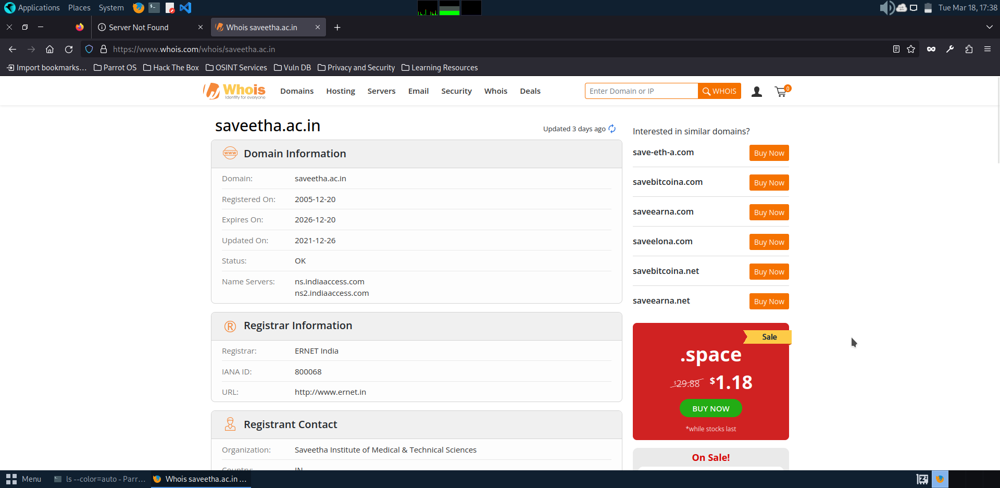
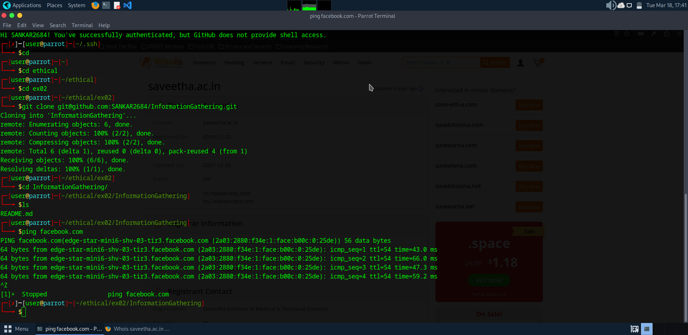
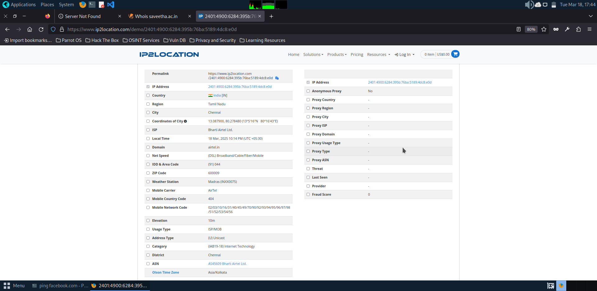
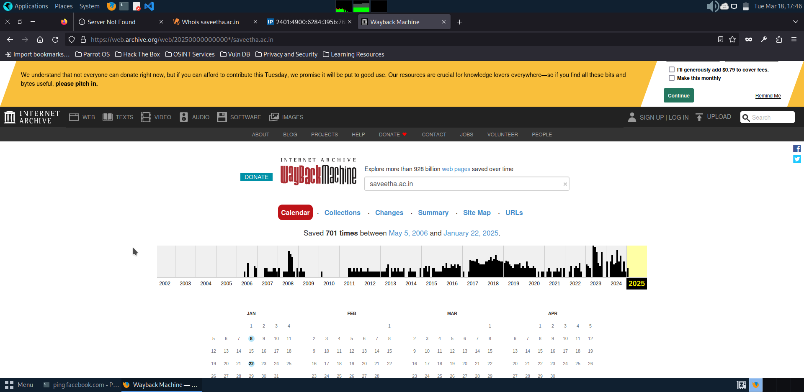
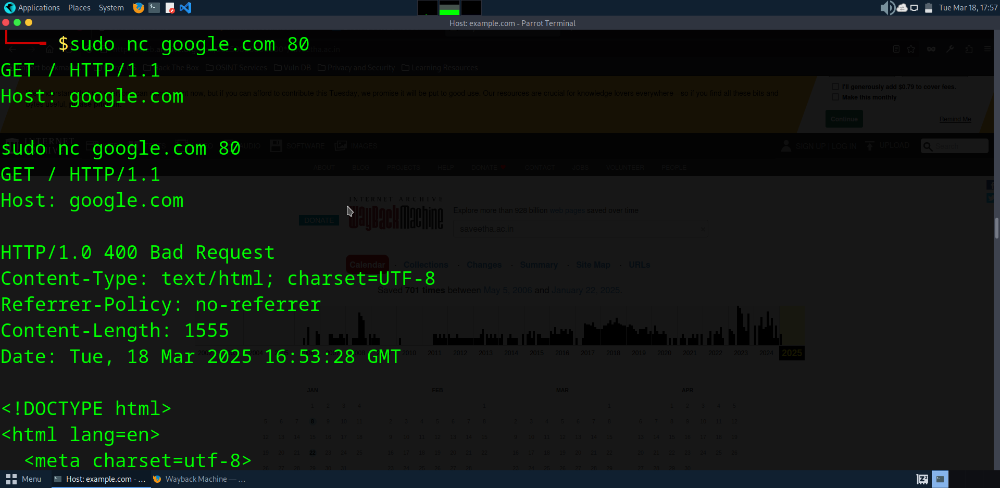
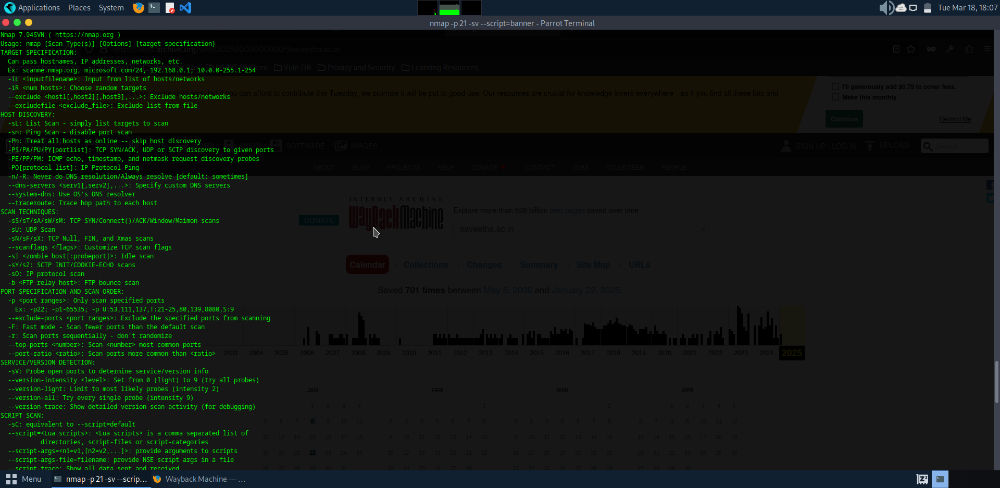
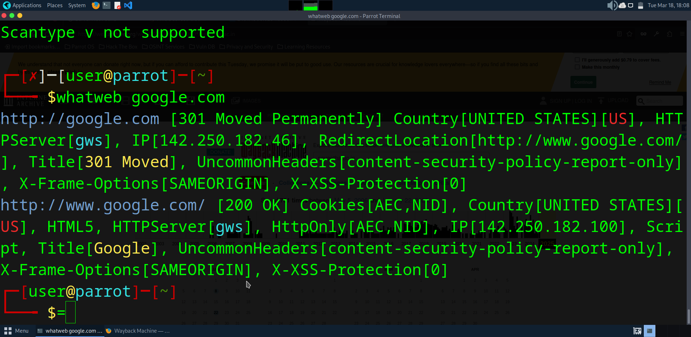
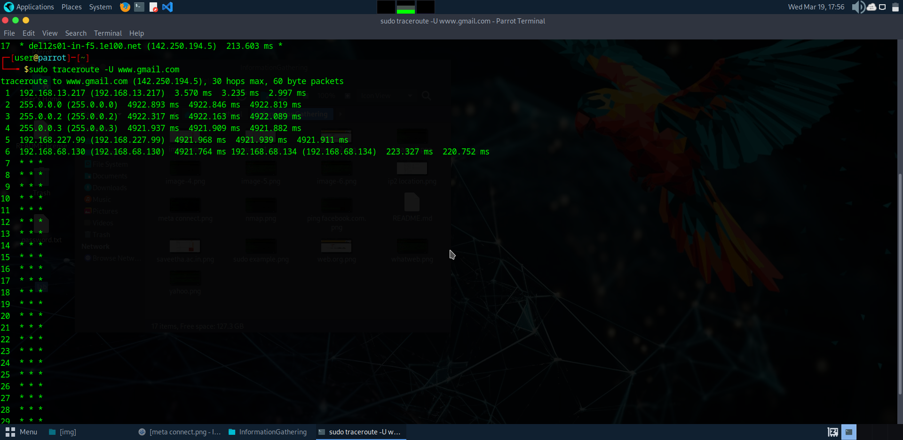
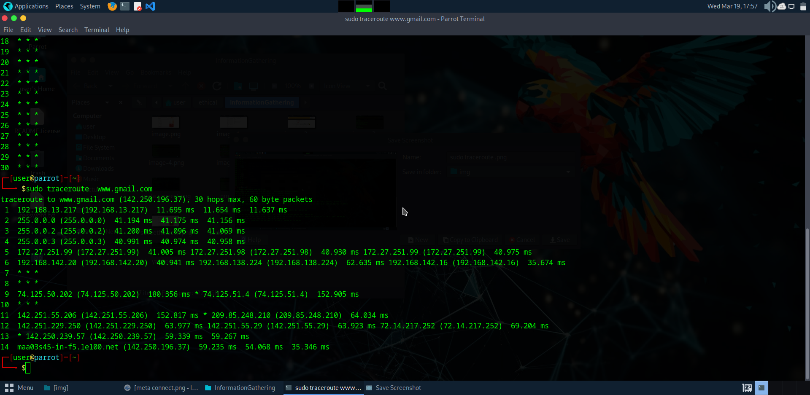

# InformationGathering
Information Gathering Techiques

# To perform information gathering techniques

# AIM:

To perform information gathering techniques using kali linux 

## STEPS:

### Step 1:

Install kali linux either in partition or virtual box or in live mode

### Step 2:

Investigate on the various categories of tools as follows:

### Step 3:
Open terminal/browser and try execute necessary commands/use url to perform information gathering

## OUTPUT:
Who is:
OUTPUT:

Finding IP Address:

IP Address of FACEBOOK.com
OUTPUT:

Finding Hosting Company
get further detail by using ip2location.com website.

OUTPUT:

Histoey Of The Website:
OUTPUT:

Netcat:
OUTPUT:
sudo nc google.com 80
GET / HTTP/1.1
Host: google.com

OUTPUT:

NMAP:
OUTPUT:

Whatweb
OUTPUT:

Whatweb -v 3 172.17.62.8

Httprint
OUTPUT:

Tracing The Location
TCP Traceroute:
sudo -T ww.gmail.com

OUTPUT:

UDP Traceroute:
sudo traceroute -U www.gmail.com
OUTPUT:

ICMP Traceroute:
sudo traceroute  www.gmail.com
OUTPUT:

## RESULT:
The information gathering techniques tools/procedure were  identified successfully
